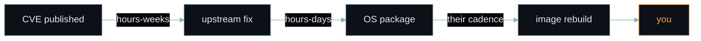

# MISSION POSSIBLE

## The 45-Minute Path to Bullet-Proof Java Container Images

Pasha Finkelshteyn · Developer Advocate, BellSoft

<div class="handle">@asm0dey</div>

<!--
**Deck up**
-->

---
layout: center
---

# Clearance check

Hands up.

<v-clicks>

1. Who ships Java in containers to production?
2. Who has a team that owns your base images?

</v-clicks>

<!--
**Do not explain why yet**
their answer changes how hard you push 'Fund it'
PLANT → `hands-up-count`
-->

---
layout: full
class: fullbleed zone-upper
---

<div class="bg-image" style="background-image:url(/illustrations/slide-03.jpg)"></div>

<div class="scrim"></div>

<h1 class="overlay-title">You're already in the room</h1>

<!--
genre beat - let the image carry it
PLANT → `the-room`
-->

---
layout: center
---

# The room is your image

| in the room | in production |
|---|---|
| the room | your container image |
| the water | the CVE feed, arriving forever |
| the threat | the one CVE that's exploitable in **your** context |

<!--
concrete first, principle second
-->

---
layout: image-left
image: /pasha.jpeg
class: imgtxt dossier
---

<div class="dossier-head">PERSONNEL FILE · BPI-2026 · EYES ONLY</div>

# Pasha Finkelshteyn

<div class="field"><span>ROLE</span>Developer Advocate, BellSoft</div>
<div class="field"><span>SERVICE</span>10+ years in the JVM ecosystem</div>
<div class="field"><span>LANGUAGES</span>Java · Kotlin</div>
<div class="field"><span>FIELD RECORD</span>Has built hardened images by hand</div>
<div class="field"><span>NOTE</span>Will be honest about what it costs</div>

<div class="stamp">CLEARED</div>

<!--
credentials only now, after the hook
-->

---
layout: default
---

# Guess first

```docker
FROM eclipse-temurin:25-jdk
WORKDIR /app
COPY . /app
RUN ./gradlew build
CMD ["java","-jar","app.jar"]
```

<v-click>

How many known CVEs?

</v-click>

<!--
make them commit a number out loud BEFORE the reveal
`TODO: DATA-01`
-->

---
layout: default
---

# The scan

```bash {1|2|3-5|6|all}
$ trivy image app:latest
Total: 46 (CRITICAL: 1, HIGH: 3, MEDIUM: 18, LOW: 24)
LIBRARY       VULNERABILITY    SEVERITY  INSTALLED  FIXED
libssl3       CVE-2026-xxxxx   CRITICAL  3.0.13     3.0.14
libtasn1-6    CVE-2026-xxxxx   HIGH      4.19.0     4.19.1
zlib1g        CVE-2026-xxxxx   MEDIUM    1.3.1      (none)
```

<v-click>

42 of them came with the base image. 4 are yours.

</v-click>

<!--
**Say nothing about the FIXED column**
PLANT → `patch-column`
`TODO: DATA-01`
-->

---
layout: default
---

# It gets worse

| base image | known CVEs |
|---|---|
| eclipse-temurin:25-jdk | 46 |
| openjdk:25 (deprecated) | 72 |
| openjdk:21 (deprecated) | 132 |

<!--
`TODO: DATA-02`
-->

---
layout: full
class: fullbleed zone-upper
---

<div class="bg-image" style="background-image:url(/illustrations/slide-09.jpg)"></div>

<div class="scrim"></div>

<h1 class="overlay-title">The same image. Two weeks later.</h1>

<!--
genre beat - let the image carry it
`TODO: DATA-03`
-->

---
layout: default
---

# Why this costs money

vulnerability -> remote code execution -> data breach

<v-click>

~6% of published CVEs have been exploited in the wild  
average breach cost: $4.44M (US: $10.22M)

</v-click>

<v-click>

Money is recoverable. An audit finding follows you for years.

</v-click>

<v-click>

sources: [Cyentia & FIRST, EPSS Data and Performance (2024)](https://www.cyentia.com/publication/exploit-prediction-scoring-system-2/) · [IBM, Cost of a Data Breach (2025)](https://www.ibm.com/reports/data-breach)

</v-click>

<!--
About six percent of published vulnerabilities have ever been exploited in the wild. Of your forty-six, that is roughly three. Not all of them are going to hurt you. A few will.

The average breach costs four point four million dollars. In the US it is over ten. In this room I suspect that is not the number that frightens you.

13,807 of 237,687 CVEs exploited as of 2024-05-31 (Cyentia/FIRST EPSS report). IBM 2025: global avg $4.44M, US $10.22M.
-->

---
layout: statement
class: bigidea
---

<div class="bigidea-text">You're running a Linux distribution that nobody in your organisation agreed to maintain.</div>

<!--
**Stop walking**
Big Idea lands; after this nobody is neutral
-->

---
layout: default
---

# Mission briefing

**OBJECTIVE** — not zero CVEs. **Zero unmanaged risk.**

*Every CVE left is either fixed, or accepted by a named owner with an expiry date.*

<v-clicks>

1. **Limit privileges** — when it goes wrong, it goes wrong smaller
2. **Shrink the surface** — less to reason about
3. **Classify by context, not by score** — work on what can actually hurt you
4. **Patch what's left** — fix the critical ones
5. **Prove it to your auditor** — what's inside, who built it, where it came from

</v-clicks>

<!--
**Point at step 4 as you say 'stops being a tutorial'**
plant it and move on - do NOT explain
PLANT → `step-four-is-different`
-->

---
layout: section
class: divider
---

<div class="step-num">STEP 1</div>

# Limit privileges

<div class="step-goal">Goal: when it goes wrong, it goes wrong smaller.</div>

<!--
Step 1-2 — shrink the blast radius, shrink the surface
-->

---
layout: default
---

# Don't run as root

```docker
USER 1234:1234

# or, explicitly:
RUN addgroup -S app && adduser -S app -G app
USER app
```

<!--
Step 1-2 — shrink the blast radius, shrink the surface
-->

---
layout: default
---

# Drop everything, add back what you need

```bash {1|2|3-4|5|all}
--privileged            # almost never
--cap-drop=ALL
--cap-add=NET_BIND_SERVICE
--security-opt=no-new-privileges
--read-only  --tmpfs /tmp
```

<div class="code-note">
  <div v-click.hide="1">Hands the container the host. If you need it, you need a VM.</div>
  <div v-click="[1,2]">Start from zero capabilities — not from Docker's default set.</div>
  <div v-click="[2,3]">Add back the one you actually need, and forbid regaining any more.</div>
  <div v-click="[3,4]">Immutable filesystem. Writable scratch only where the app really writes.</div>
  <div v-click="4">Four flags. No rebuild, no code change, works on the image you ship today.</div>
</div>

<!--
Step 1-2 — shrink the blast radius, shrink the surface
-->

---
layout: section
class: divider
---

<div class="step-num">STEP 2</div>

# Shrink the surface

<div class="step-goal">Goal: less to reason about, not fewer megabytes.</div>

<!--
Step 1-2 — shrink the blast radius, shrink the surface
-->

---
layout: default
---

# The JDK is a build tool

<v-clicks>

- **Ship the JRE, not the JDK** — a compiler in production is a gift to anyone who gets a shell
- **Multi-stage build** — the toolchain never reaches the final image
- **Minimal base** — Alpaquita, Alpine, distroless

</v-clicks>

<v-click>

Spoiler: not all minimal Linuxes are equally maintained.

</v-click>

<!--
**Land the spoiler line and move on without explaining it**
plant it and move on - do NOT explain
PLANT → `not-all-linuxes`
-->

---
layout: default
---

# The Dockerfile, rewritten

```docker {1-4|6-10|all}
FROM bellsoft/liberica-runtime-container:jdk-25-musl AS builder
WORKDIR /app
COPY . /app
RUN ./gradlew build

FROM bellsoft/liberica-runtime-container:jre-25-musl
USER 1234:1234
WORKDIR /app
COPY --from=builder /app/build/libs/app.jar .
CMD ["java","-jar","app.jar"]
```

<!--
Step 1-2 — shrink the blast radius, shrink the surface
-->

---
layout: default
---

# 46 → 7, for two lines

```text
46  ->  7
1 GB  ->  ~180 MB
```

<v-click>

remaining: 3 in the base image  
  1 critical   1 high   1 medium

</v-click>

<!--
**The tone shifts here**
`TODO: DATA-05`
-->

---
layout: section
class: divider
---

<div class="step-num">STEP 3</div>

# Classify by context

<div class="step-goal">Goal: work on what can actually hurt you.</div>

<!--
Step 3 — triage under fire
-->

---
layout: default
---

# What CVSS can't tell you

CVSS = how bad this COULD be, in the abstract.

It doesn't know:

<v-clicks>

- whether you call that code path
- whether it's reachable from outside
- whether a fix exists

</v-clicks>

<v-click>

**Example:** [Spring4Shell, CVE-2022-22965](https://spring.io/security/cve-2022-22965) — CVSS **9.8**.  
Known exploit needs a WAR on Tomcat. A Spring Boot fat jar: not exploitable that way.

</v-click>

<v-click>

Sorting by CVSS is sorting by someone else's worst case.

</v-click>

<!--
Step 3 — triage under fire
-->

---
layout: default
---

# Escalate, de-escalate

Start at the CVSS score. Then move it with what only you know.

| ↑ ESCALATE | ↓ DE-ESCALATE |
|---|---|
| internet-facing | not reachable from outside |
| on the hot path | behind a control you own |
| lateral movement possible | single service, contained |

<!--
Start at CVSS, move it with what only you know. Spring4Shell callback.
-->

---
layout: center
---

# One row of the triage table

| CVE-2026-xxxxx | |
|---|---|
| component | libssl3 — base image, not ours |
| reachable? | yes, TLS terminates in-process |
| patch? | yes, 3.0.14 |
| exposure | internet-facing |
| blast radius | lateral movement possible |
| CVSS | 9.1 critical |

<v-click>

### → PATCH NOW

</v-click>

<!--
one worked row - the method, not the form
eight columns, and CVSS is only one of them
full blank form is on the checklist
-->

---
layout: default
---

# Three outcomes, one rule

<v-clicks>

- **Patch now** — exploitable, exposed, big blast radius, and a patch exists
- **Next update** — lower exposure, lower exploitability, patch exists
- **Accept** — not exploitable in your context
- **No patch yet?** That's step 4.

</v-clicks>

<v-click>

Meanwhile, careful:

```bash
$ trivy image --ignore-unfixed app:latest
```

hides every CVE without a fix — from the report, not from production.

</v-click>

<v-click>

Every acceptance should carry an expiry date and a name.

</v-click>

<!--
**Third foreshadow of the crisis** — on the --ignore-unfixed line. Do not elaborate.
-->

---
layout: section
class: divider
---

<div class="step-num">STEP 4</div>

# Patch what is left

<div class="step-goal">Goal: fix the critical one.</div>

<!--
No patch is coming
-->

---
layout: default
---

# Pull the fresh base

```bash
$ docker pull debian:bookworm-slim     # newest
$ trivy image app:latest
```

<v-click>

| Library | Vulnerability | Severity | Status | Installed | Fixed |
|---|---|---|---|---|---|
| zlib1g | CVE-2023-45853 | CRITICAL | will_not_fix | 1:1.2.13.dfsg-1 | |

</v-click>

<v-click>

Fixed upstream in **zlib 1.3.1** — January 2024.  
The newest bookworm image still ships **1.2.13**.

</v-click>

<v-click>

sources: [NVD, CVE-2023-45853](https://nvd.nist.gov/vuln/detail/CVE-2023-45853) · [Debian security tracker](https://security-tracker.debian.org/tracker/CVE-2023-45853) · [zlib 1.3.1 release](https://github.com/madler/zlib/releases/tag/v1.3.1)

</v-click>

<!--
**Point at the empty Fixed column**
← PAYOFF `patch-column`

If challenged: Debian marks it ignored because minizip isn't built in bookworm.
That's a context call (step 3) - you only know it after you do the triage yourself.
-->

---
layout: full
class: fullbleed zone-lower
---

<div class="bg-image" style="background-image:url(/illustrations/slide-27.jpg)"></div>

<div class="scrim"></div>

<h1 class="overlay-title">The fix exists. It isn't here.</h1>

<!--
the plan stops working - let it hurt
-->

---
layout: default
---

# Why it isn't here

<br>



<v-click>

<div class="mt-14">

A free image is a gift, not a commitment.  
Nobody in that chain owes you a date - including us.

</div>

</v-click>

<!--
depth is the credibility here
-->

---
layout: default
---

# The vote

So what do we do?

<v-clicks>

1. Wait for the patch
2. Ask upstream and wait
3. Abort — ship it anyway, accept the risk

</v-clicks>

<!--
make them commit a number out loud BEFORE the reveal
-->

---
layout: none
class: blackout
---

<div class="blackout-slide"></div>

<!--
**Bring the deck back up on the next slide.**
screen to black, step forward, nothing to read
← PAYOFF `step-four-is-different`
-->

---
layout: full
class: fullbleed zone-lower
---

<div class="bg-image" style="background-image:url(/illustrations/slide-31.jpg)"></div>

<div class="scrim"></div>

<h1 class="overlay-title">You were never meant to run this alone</h1>

<!--
they are the hero, you are the handler
-->

---
layout: default
---

# What shift-left actually means

"Shift security left"

<v-click>

**Not:** every developer becomes an amateur OS and runtime maintainer.  
**But:** someone explicitly owns the base layer, instead of it being diffused into everyone's backlog.

</v-click>

<!--
they are the hero, you are the handler
-->

---
layout: quote
---

# "I don't want to pay a vendor. I want to pay my own developers."

the objection, in its strongest form

<!--
**Say this in someone else's voice, not your own**
voice the objection at FULL strength before they can
-->

---
layout: default
---

# What it actually costs

Per base image. Rough estimates — your numbers will differ, the shape won't.

| | set up once | ongoing |
|---|---|---|
| non-root, drop capabilities | 1–2 days | ≈ 0 |
| minimal base, multi-stage build | 2–3 days | ≈ 0 |
| scanning in CI + triage process | 2–3 days | 2–4 h/wk |
| patch: apply updates, regression-test, roll out | — | 4–8 h/wk |
| JDK security update (now monthly) | — | ½–1 day a month |
| signing, SBOM, provenance | 3–5 days | ~1 h/wk |
| **backport a fix that isn't shipped** | — | **days, every time** |
| **TOTAL** | **~2–3 weeks** | **8–15 h/wk + every backport** |

<!--
**Callback: the hands from slide 2.**
this is the line they repeat afterwards
← PAYOFF `hands-up-count`
-->

---
layout: default
---

# Ownership is the decision

Someone must own the base layer under an SLA.  
It can be your platform team - if it's funded like a distro team.

Whoever it is, require:

<v-clicks>

- demonstrable OS + runtime security expertise
- signed evidence shipped with the artifact
- a patch SLA with a number on it
- components built from source

</v-clicks>

<!--
name the limits; no product verdict
← PAYOFF `not-all-linuxes`
-->

---
layout: center
---

# What a hardened base ships

<v-clicks>

- **Trusted** — low-to-zero CVEs by design, and patched continuously
- **Transparent** — SBOM ships inside the image, no package manager, immutable component set
- **Verifiable** — signed and attested, provenance you can check against a public key

</v-clicks>

<!--
What that looks like concretely
-->

---
layout: default
---

# For example

```docker {1-4|6-10|all}
FROM bellsoft/liberica-runtime-container:jdk-25-glibc AS builder
WORKDIR /app
COPY . /app
RUN ./gradlew build

FROM bellsoft/hardened-liberica-runtime-container:jre-25-glibc-distroless
# non-root already. no shell. no package manager.
WORKDIR /app
COPY --from=builder /app/build/libs/app.jar .
CMD ["java","-jar","app.jar"]
```

<!--
**Disclose plainly, once, and do not linger**
name the limits; no product verdict
-->

---
layout: default
---

# 7 → 0, plus evidence

| metric | original | shrunk | hardened |
|---|---|---|---|
| known CVEs | 46 | 7 | 0 |
| image size | 1 GB | 180 MB | ~200 MB |
| base provenance | none | none | signed+SBOM |

<!--
`TODO: DATA-07`
-->

---
layout: section
class: divider
---

<div class="step-num">STEP 5</div>

# Prove it to your auditor

<div class="step-goal">Goal: evidence that outlives the scan.</div>

<!--
Step 4-5 — prove the extraction
-->

---
layout: default
---

# Three questions

| the question | what answers it |
|---|---|
| Did this image come from who it claims? | signature |
| What's actually inside it? | SBOM |
| Who built the thing in production, and how? | attestation |

**Attestation** = a signed record from your build: which commit, which pipeline, which steps.

<v-click>

Until you can answer all three, you're trusting on faith.  
Faith doesn't pass an audit.

</v-click>

<!--
Step 4-5 — prove the extraction
-->

---
layout: default
---

# Pin by digest

```docker
# bellsoft/liberica-runtime-container:jre-25-glibc
FROM bellsoft/liberica-runtime-container@sha256:<digest>
```

```text
# tags move. digests don't.
```

<!--
Step 4-5 — prove the extraction
-->

---
layout: default
---

# "Isn't Latest Safer Than Pinned?"

"If I always build from latest, I always have the patches."

<v-click>

latest:  patches arrive free   |  untested changes arrive free  
pinned:  you ship what you tested  |  patches wait for you

</v-click>

<v-click>

Pin what you tested. Automate the proposal. Keep the human in the test.

</v-click>

<!--
voice the objection at FULL strength before they can
-->

---
layout: default
---

# Verify the signature

```bash
$ cosign verify \
    --key cosign.pub \
    <image>@sha256:<digest>
```

<v-click>

Run this BEFORE you build on top of it.  
If the foundation is forged, everything above it is too.

</v-click>

<!--
Step 4-5 — prove the extraction
-->

---
layout: default
---

# Split the SBOM

| BASE IMAGE SBOM | APPLICATION SBOM |
|---|---|
| OS + runtime packages | your dependencies |
| ships with the image | you generate it in CI |
| owned by whoever owns the base layer | owned by you |

<v-click>

Store them together. Never merge them.

</v-click>

<!--
plant it and move on - do NOT explain
PLANT → `sbom-split`
-->

---
layout: default
---

# Generating yours

```xml
<plugin>
  <groupId>org.cyclonedx</groupId>
  <artifactId>cyclonedx-maven-plugin</artifactId>
  <configuration>
    <includeCompileScope>true</includeCompileScope>
    <includeRuntimeScope>true</includeRuntimeScope>
    <includeTestScope>false</includeTestScope>
  </configuration>
</plugin>
```

```text
# Gradle has an equivalent plugin.
```

<!--
Step 4-5 — prove the extraction
-->

---
layout: default
---

# Scan the SBOM, not the image

```bash
$ osv-scanner -L target/app-sbom.cdx.json
$ osv-scanner -L base-image-sbom.cdx.json
```

<v-click>

faster  ·  reproducible  ·  tied to an exact digest

</v-click>

<v-click>

then triage with the table from step 3

</v-click>

<!--
← PAYOFF `sbom-split`
-->

---
layout: default
---

# Hardened isn't permanent

The supplier keeps patching.  

Your pipeline doesn't notice.

<v-click>

A hardened image you pulled in March is a March image in September.

</v-click>

<!--
Keeping the room clean
-->

---
layout: default
---

# Let the robots open the PRs

Renovate / Dependabot

<v-clicks>

- watch: base image digest + application dependencies
- do:    open a PR when either moves

</v-clicks>

<v-click>

They're good workers and stupid ones.  
The PR is the proposal. You still run the tests.

</v-click>

<!--
humour serves the argument, never replaces it
-->

---
layout: full
class: fullbleed zone-upper
---

<div class="bg-image" style="background-image:url(/illustrations/slide-49.jpg)"></div>

<div class="scrim"></div>

<h1 class="overlay-title">Not sterile. Liveable.</h1>

<!--
**Point at the tide line.**
end higher than you started - not on a to-do list
← PAYOFF `the-room`
-->

---
layout: default
---

# Mission debrief

| metric | before | after |
|---|---|---|
| known CVEs | 46 | 0 |
| image size | 1 GB | ~200 MB |
| base image | whatever | pinned + signed |
| evidence | none | SBOM+attestation |

<v-click>

Every number here is reproducible by you, tomorrow.

</v-click>

<!--
Mission debrief
-->

---
layout: default
---

# Monday

Four things. Start Monday.

<v-clicks>

- **Run it** — scan one production image before your next sprint planning; bring two numbers, raw count and exploitable-in-context
- **Fund it** — make the base layer a line item: an SLA with a supplier, or headcount to staff your platform team like a distro team
- **Say it** — kill raw CVE counts as a reporting metric; report exploitable-in-context and change what the dashboard shows
- **Build it** — take one service end to end — pinned digest, verified signature, SBOM in CI — as the reference everyone copies

</v-clicks>

<!--
four asks, aimed at four different people
-->

---
layout: default
---

# The checklist is yours

<div class="grid grid-cols-[1fr_auto] gap-12 items-center">
<div>

[asm0dey.github.io/docker-hardening-checklist](https://asm0dey.github.io/docker-hardening-checklist/)

<v-click>

Every step in this talk, as a checklist. No strings.

</v-click>

<v-click>

[OWASP Docker Security Cheat Sheet](https://cheatsheetseries.owasp.org/cheatsheets/Docker_Security_Cheat_Sheet.html)  
[osv-scanner](https://github.com/google/osv-scanner)  ·  [trivy](https://trivy.dev/)  ·  [cosign](https://github.com/sigstore/cosign)  ·  [CycloneDX](https://cyclonedx.org/)  ·  [SLSA](https://slsa.dev/)

</v-click>

<v-click>

@asm0dey

</v-click>

</div>


</div>

<!--
name the limits; no product verdict
`TODO: IMAGE-01`
-->

---
layout: full
class: fullbleed zone-lower
---

<div class="bg-image" style="background-image:url(/illustrations/slide-53.jpg)"></div>

<div class="scrim"></div>

<h1 class="overlay-title">Mission accomplished. For today.</h1>

<!--
closes the image you opened with
-->
